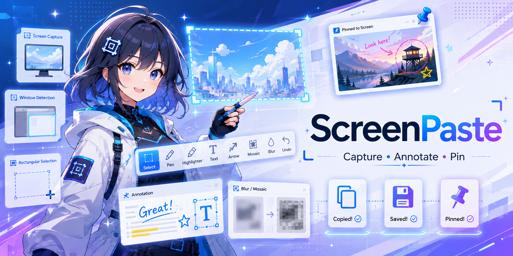
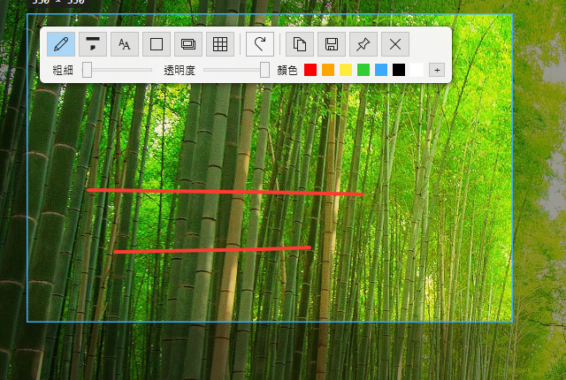

[繁體中文](README.md) | [English](README.en.md) | [日本語](README.ja.md) | [한국어](README.ko.md) | [Français](README.fr.md) | **Deutsch** | [Español](README.es.md)

# ScreenPaste

Ein leichtgewichtiges Windows-Tool für Screenshots, Anmerkungen und Bildschirmaufnahmen: mit einem Tastendruck aufnehmen, sofort beschriften, am Bildschirm anheften und beliebige Bereiche als GIF / MP4 / WebP aufzeichnen.

## Funktionen

### Aufnahme
- Der gesamte Bildschirm (Multi-Monitor-Unterstützung)
- **Automatische Fenster- und UI-Element-Erkennung**: Fahren Sie über ein Fenster oder ein Interface-Element (Schaltflächen, Panels, Webseiten-Blöcke), um es automatisch zu umranden, und klicken Sie zum Aufnehmen; das **Mausrad** wechselt die Erkennungsebene (Element ⇄ Fenster)
- Ziehen zum Auswählen eines eigenen Bereichs, mit Größenanzeige; eine **Pixel-Lupe** folgt dem Cursor durchgehend (Auswahl- und Bearbeitungsmodus) mit Fadenkreuz, Koordinaten und Pixelfarbe — `C` kopiert den Farbwert, `Umschalt` wechselt Hex/Dezimal
- **Nach der Auswahl anpassbar**: Ziehen Sie die Griffe an Ecken und Kantenmitten zum Ändern der Größe; ohne aktives Werkzeug verschiebt Ziehen im Inneren den Bereich — vorhandene Anmerkungen bleiben am Inhalt verankert

### Anmerkungen
Nach der Aufnahme erscheint neben dem Cursor eine **Symbol-Werkzeugleiste** (verschiebbar, weicht Bildschirmrändern automatisch aus):

- **Marker** — deckende Striche; Stärke / Farbe / Deckkraft einstellbar
- **Textmarker** — halbtransparente Überlagerung; Stärke / Farbe / Deckkraft einstellbar
- **Text** — Schriftart / Größe / Farbe / Stil (normal, fett, kursiv, durchgestrichen); ein Klick außerhalb des Felds bestätigt den Text
- **Formen** — Rechteck / abgerundetes Rechteck / Ellipse, Umriss oder gefüllt, Linienstärke und Farbe einstellbar
- **Linie / Pfeil** — zum Zeichnen ziehen; jedes Ende kann einzeln eine Pfeilspitze erhalten; Stärke und Farbe einstellbar; mit `Umschalt` an 45°-Winkeln einrasten
- **Eingefügte Bilder** — PNG / JPEG / WebP einfügen, ziehen zum Verschieben, Mausrad zum Skalieren
- **Weichzeichnen** — Gaußscher Weichzeichner / Mosaik, Stärke einstellbar
- **Direktes Auswählen / Verschieben** — fahren Sie über eine platzierte Anmerkung und **ziehen Sie sie direkt**; `Entf` löscht sie; Verschieben und Löschen sind rückgängig machbar
- **Farbwähler** — Hex-Eingabe, RGB und Deckkraft (transluzente Farben werden über einem Schachbrett angezeigt); eigene Farben werden sitzungsübergreifend gespeichert, Rechtsklick auf ein Farbfeld entfernt es
- **Rückgängig / Wiederholen** — per Schaltfläche und Tastenkürzel; jeder Schieberegler zeigt den aktuellen Wert an

### Ausgabe
- In die Zwischenablage kopieren
- Als PNG / JPG speichern (Speichern unter oder Schnellspeichern in einen Standardordner)
- **Am Bildschirm anheften**: Das Bild schwebt im Vordergrund; ziehen zum Verschieben, Mausrad zum Zoomen, Rechtsklick für das Menü; bei mehreren Pins schließt Esc zuerst den fokussierten, ohne Fokus alle

### Bereichsaufnahme
- Ein eigener globaler Hotkey (standardmäßig **F2**): Bereich per Ziehen auswählen und aufnehmen, erneut drücken (oder Stopp klicken) zum Beenden
- Während der Aufnahme markiert ein roter Rahmen den Bereich, dazu eine kleine Leiste mit Timer und Stopp-Schaltfläche
- Nach der Aufnahme öffnet sich ein **Editor**: Schleifenvorschau, Trimm-Griffe auf der Zeitleiste (`Leertaste` Wiedergabe, `←`/`→` Einzelbild, `I`/`O` für Start-/Endpunkt), Export mit Fortschrittsbalken
- Export als **GIF / MP4 / WebP**, direkt im Editor umschaltbar; eine Einstellung überspringt den Editor und speichert sofort
- Optionale Mauszeiger-Aufnahme, Bildrate 10–30 fps
- Kodierung durch das mitgelieferte `ffmpeg` — keine separate Installation nötig

### Sonstiges
- Globale Hotkeys (**F1** Aufnahme, **F2** Aufzeichnung, beide konfigurierbar) und Start über das **Infobereich**-Symbol
- **Mehrsprachig**: 繁體中文 / English / 日本語 / 한국어 / Français / Deutsch / Español (folgt standardmäßig dem System)
- **Hell / Dunkel / System**-Design, moderne abgerundete Oberfläche und dunkle Titelleisten
- Zentrales **Einstellungsfenster**: Sprache, Hotkeys, Design, Autostart, Speicherordner, Aufnahmeformat / Bildrate (Hotkey-Felder werden durch einfaches Drücken der Kombination gesetzt)
- Optionaler **Autostart mit Windows**
- **Auto-Update**: prüft über GitHub Releases auf neue Versionen (in den Einstellungen umschaltbar, auch manuell); Download und Installation mit einem Klick

## Installation

Download unter [Releases](https://github.com/taida957789/ScreenPaste/releases):

- **`ScreenPaste-<version>-setup.exe`** — Installer (keine Administratorrechte nötig, installiert nach `%APPDATA%\ScreenPaste`, mit Startmenü-Verknüpfung und Deinstallation)
- **`ScreenPaste-<version>-win-x64-portable.zip`** — portable Version ohne Installation

Beide sind eigenständig — **kein separates .NET Runtime erforderlich**, und `ffmpeg` (für die Bereichsaufnahme) ist enthalten.

## Schnellstart

1. Nach dem Start bleibt das Tool im Infobereich; **F1** (oder Doppelklick auf das Symbol) startet eine Aufnahme.
2. Über ein Fenster oder UI-Element fahren, um es zu umranden, und klicken — oder einen Bereich per Ziehen auswählen.
3. Ein Werkzeug aus der Leiste wählen, Parameter anpassen und die Auswahl beschriften.
4. **Kopieren / Speichern / Anheften** zur Ausgabe; `Esc` verlässt die Aufnahme (fragt nach, wenn Anmerkungen vorhanden sind — mit „Nicht mehr fragen“-Option).

Aufzeichnung: **F2** drücken und den Bereich per Ziehen wählen; erneut **F2** (oder Stopp) beendet, danach im Editor prüfen, trimmen und als GIF/MP4/WebP exportieren (per Einstellung auch Sofortspeichern).

## Tastenkürzel

| Kontext | Tasten | Aktion |
|---|---|---|
| Global | `F1` | Aufnahme starten (konfigurierbar) |
| Global | `F2` | Bereichsaufnahme starten / stoppen (konfigurierbar) |
| Auswahl | Mausrad | Erkennungsebene wechseln (UI-Element ⇄ Fenster) |
| Auswahl / Anmerkung | `C` | Farbwert des Pixels unter der Lupe kopieren |
| Auswahl / Anmerkung | `Umschalt` | Farbanzeige Hex / Dezimal umschalten |
| Anmerkung | `Strg+Z` / `Strg+Y` | Rückgängig / wiederholen (konfigurierbar) |
| Anmerkung | `Strg+C` | In die Zwischenablage kopieren (konfigurierbar) |
| Anmerkung | `Strg+S` / `Strg+Umschalt+S` | Speichern unter / Schnellspeichern (konfigurierbar) |
| Anmerkung | `Entf` | Ausgewählte Anmerkung löschen |
| Anmerkung | `Umschalt` + Ziehen (Linie) | An 45°-Winkeln einrasten |
| Anmerkung | `Eingabe` oder Klick außerhalb | Text bestätigen (`Umschalt+Eingabe` für Zeilenumbruch) |
| Anmerkung | `Esc` | Auswahl aufheben → Aufnahme verlassen (fragt bei Anmerkungen) |
| Aufnahme-Editor | `Leertaste` | Wiedergabe / Pause |
| Aufnahme-Editor | `←` / `→` | Einzelbild vor / zurück |
| Aufnahme-Editor | `Pos1` / `Ende` | Zum Trimm-Anfang / -Ende springen |
| Aufnahme-Editor | `I` / `O` | Trimm-Anfang / -Ende an der Wiedergabeposition setzen |
| Angeheftetes Fenster | `Strg+C` / `Esc` | Kopieren / schließen |

Alle Einstellungen (Hotkeys, Werkzeug-Standardwerte, Design, Autostart, Aufnahmeformat / Bildrate usw.) lassen sich über das Infobereich-Menü → „Einstellungen…“ anpassen.

> Beim Bauen aus dem Quellcode: einmal `scripts/fetch-ffmpeg.ps1` ausführen, um das mitgelieferte `ffmpeg.exe` herunterzuladen (die CI erledigt das beim Release automatisch).
